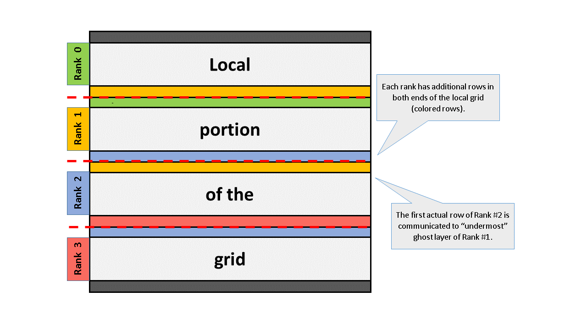

## Parallel heat equation

Parallelize the [heat equation](serial/heat.py) program with MPI,
by dividing the grid into blocks of rows and assigning one row block to one
task. A domain decomposition, that is.

Note that the tasks are able to update the grid independently everywhere else
than on the boundary rows – there the communication of a single row with the
nearest neighbor is needed. This can be achieved by having additional ghost
layers that contain the boundary data of the neighboring tasks. As the system
is aperiodic, the outermost ranks communicate with a single neighbor, and the
inner ranks with two neighbors.

Insert suitable MPI routines into the skeleton code in
[skeleton.py](skeleton.py) (search for "TODO"s).
Remember to update all ghost layers at each iteration.

Examples of mpi4py APIs could be found here : https://mpi4py.readthedocs.io/en/stable/tutorial.html

A schematic representation of the decomposition looks like:

